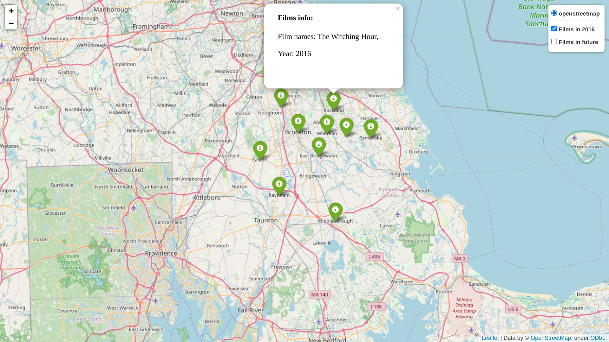
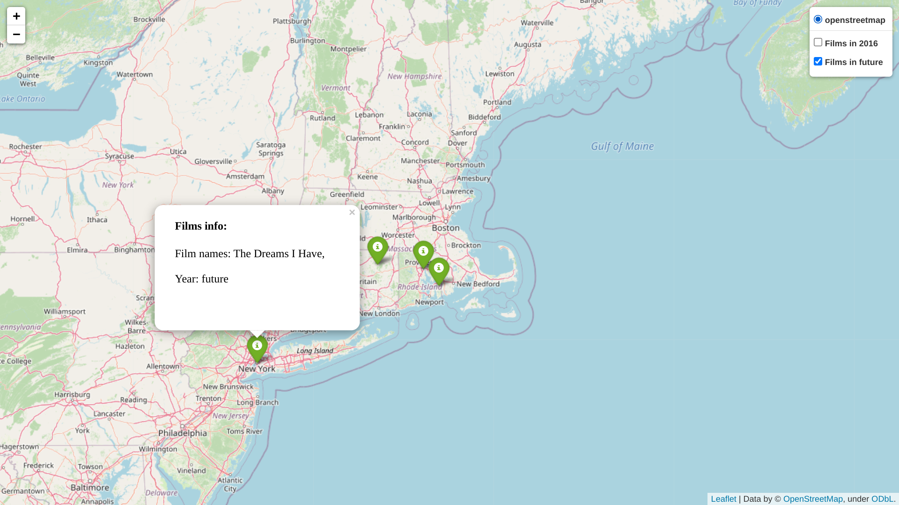

# Films location map builder

The purpose of this module to build an html file
with an interactive map in it. Map contains 
information about films that can be used for 
some kind of statistic analyzes, searching
favourite landscapes from films or popular 
filming places.

### Usage
For start a module you should use the following command:
```python
python task2.py <year> <latitude> <longitude> <path/to/films/databas>
```
### Result
As a result you will receive html file with a folium 
map in it centered on specified **latitude** and 
**longitude** which will contain 2 layers of markers:
 - 10 nearest  locations where in specified <b>year</b> 
films were made
 - All locations where films are going to be made in future

Data display using markers on the map. 
Each marker contains list of films made 
at the location marker stands at.

All data is taken from the <b>database</b> 
```location.list``` (path specified in command)

### Requirements
This module uses some python libraries:
 - **argparse**
 - **haversine**
 - **geopy**

Also, there is pre-generated cache of locations
to provide faster work of the module. 
There are two sources:
 - Firebase (preferred) requires:
   - **firebase_token.json** file, placed near module
   - **firebase-admin** python module
 - Google Docs (much slower than Firebase but 
still faster than getting data from geopy) requires:
   - **google-auth-oauthlib**
   - **google-auth-httplib2**
   - **google-api-python-client**

### Examples

```python
 python task2.py 2016 42 -71 locations.list
```

